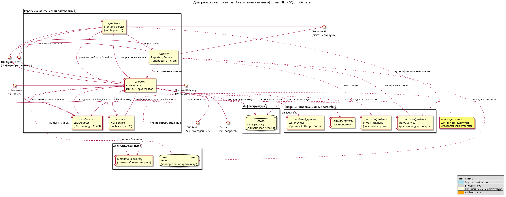
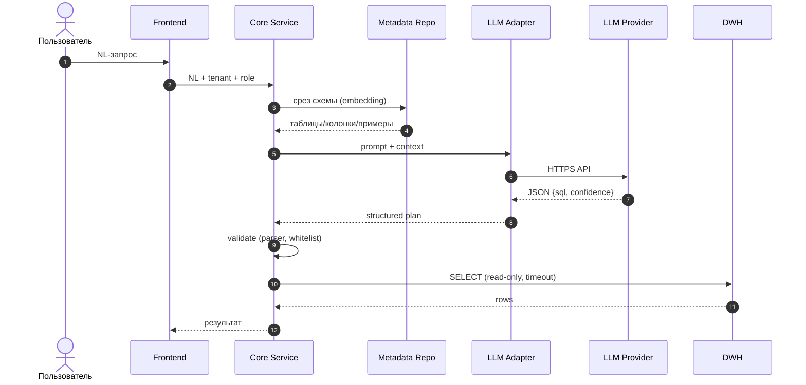

# ArchKata

## Аналитическая платформа: NL → SQL → Отчёты

Ключевые архитектурные решения

Диаграмма компонентов: <code>component-diagram.puml</code> · Дизайн-док: <code>design.md</code>

---
layout: default
---

# Оглавление

<v-clicks>

1. **Компонентная архитектура** — обзор
2. **NL → SQL** — primary-путь, валидация, fallback
3. **Кэширование** — двухуровневая модель Redis
4. **RBAC** — три точки применения
5. **Multi-tenant** — изоляция и квоты
6. **Defense in Depth** — 6 слоёв защиты
7. **Сводка решений**

</v-clicks>

---
layout: section
---

# 1. Компонентная архитектура

---
layout: default
---

# Обзор компонентной архитектуры

### Сервисы платформы
- **Frontend Service** — дашборды, UI
- **Core Service** — NL→SQL оркестратор
- **Reporting Service** — генерация отчётов
- **LLM Adapter** — обёртка над LLM API
- **NLP Service** — fallback без LLM

### Хранилища и инфраструктура
- **DWH** — корпоративное хранилище
- **Metadata Repository** — схемы и метрики
- **Redis (NoSQL)** — кэш запросов

### Внешние ИС
- **LLM Provider**, **MWS Track Rails**, **CRM**, **RBAC Service**

---
layout: default
---

# Визуальная схема

Полная диаграмма: <code>component-diagram.puml</code>

---
layout: section
---

# 2. NL → SQL

---
layout: default
---

# Primary-путь: LLM с контекстом

---
layout: default
---

# Что подаётся в LLM и что валидируется

### В промпт LLM
- Релевантный **срез схемы DWH** из Metadata Repo (embedding-близость)
- **Few-shot примеры** из каталога тенанта
- **Tenant context** — роль и доступные домены
- **Никаких данных DWH** в промпте

### Валидация SQL перед выполнением
- Парсер: только **SELECT / CTE**; whitelist ключевых слов
- **Параметризация** всех литералов (anti prompt-injection)
- **Read-only** пользователь БД
- `statement_timeout` + `LIMIT` на строки
- **Cost-guard** по `joins × rows`

**Структурированный выход:** `{ sql, params, intent, confidence, used_tables }`

---
layout: default
---

# Fallback: NLP Service

### Триггер
- **Circuit breaker** по LLM Provider
- Скользящее окно error-rate / latency
- Авто-восстановление при нормализации

### Реализация
- Правилово-шаблонный парсинг
- Словари из Metadata Repository
- **Деградация сервиса ≠ отказ**

Оба движка реализуют один интерфейс <code>INLProcessor</code> — переключение прозрачно для Core

---
layout: section
---

# 3. Кэширование запросов

---
layout: default
---

# Двухуровневый кэш (Redis)

| Уровень | Ключ | Что хранит | TTL |
|---|---|---|---|
| **L1 — NL → SQL** | `nl2sql:{tenant}:{role}:{hash(q+schema_ver)}` | SQL, confidence, used_tables | **24 ч** |
| **L2 — результат** | `qry:{tenant}:{hash(sql+params)}` | Сериализованный результат | **30 с / 1 ч / 24 ч** |

**TTL L2 зависит от класса запроса:** real-time 30 с · агрегаты 1 ч · отчёты 24 ч

<v-clicks>

**Ключ всегда включает `tenant_id`** — физически невозможно прочитать данные чужого тенанта

</v-clicks>

---
layout: default
---

# Защита и инвалидация кэша

<v-clicks>

- **Single-flight** при промахе — пересчитывает только первый запрос, остальные читают уже записанный ключ
- **Schema-driven** — bump `schema_ver` делает старые L1-ключи нечитаемыми
- **Event-driven** — CDC из DWH → точечный `DEL` по затронутым таблицам
- **Per-tenant flush** — при изменении прав или выписке тенанта

</v-clicks>

Защита от **cache stampede** важна: без неё пиковый NL-запрос может вызвать каскад однотипных LLM-вызовов и задеть rate-limit провайдера

---
layout: section
---

# 4. RBAC

---
layout: default
---

# Три точки применения RBAC

### 1. Frontend Service
- Аутентификация пользователя
- Фильтрация UI (вкладки, кнопки)
- Видимость пунктов меню

### 2. Core Service
- Авторизация запросов
- **SQL-WHERE injection** по атрибутам роли
- Физическая невозможность увидеть чужие строки

### 3. Reporting Service
- Фильтрация шаблонов отчётов
- Запрет выгрузок по доменам
- RBAC-фильтр результата

---
layout: default
---

# Кэш прав и аудит

<v-clicks>

- Кэш прав: Redis, ключ `rbac:{user_id}:{tenant_id}`, **TTL 5 мин**
- Push-инвалидация по событию `role_changed` от RBAC
- **Аудит каждого запроса:** `user_id`, `tenant_id`, `sql_hash`, `row_count`, `duration_ms`
- Логи — append-only, доступ — только ops-роль

</v-clicks>

**Цель аудита:** расследование инцидентов + соответствие регуляторным требованиям (GDPR, 152-ФЗ)

---
layout: section
---

# 5. Multi-tenant

---
layout: default
---

# Изоляция и квоты тенанта

### Идентификация и проброс
- `tenant_id` из токена, верифицирован RBAC
- Протаскивается через **все** вызовы (HTTP-header + gRPC-metadata)

### Изоляция в DWH
- **Выбор:** shared schema + колонка `tenant_id`
- Двойной пояс: SQL-WHERE injection + **Row-Level Security**
- Дисциплина: каждая выборка содержит `WHERE tenant_id = :tenant_id`

### Квоты тенанта (enforce на edge / Core)
- **Rate limit** по NL-запросам (RPS)
- **Бюджет query_cost** (rows_scanned за минуту)
- **Concurrency limit** на тяжёлые отчёты
- Отдельные алерты по превышению

### Observability
- Дашборды Grafana разнесены по `tenant_id`
- `tenant_id` — обязательный лейбл в логах и трейсах

---
layout: section
---

# 6. Defense in Depth

---
layout: default
---

# 6 слоёв изоляции данных

| Слой | Механизм |
|---|---|
| **Сетевой** | Per-tenant DB-connection pool; перспектива — per-tenant VPC |
| **Авторизация** | RBAC на каждом запросе; атрибуты роли → SQL-WHERE |
| **БД** | Read-only пользователь; RLS `USING (tenant_id = current_setting('app.tenant_id'))` |
| **Кэш** | Префикс ключа по `tenant_id`; чужой ключ физически недоступен |
| **LLM-промпт** | Только метаданные схемы + фильтры роли; никаких данных DWH |
| **Логи / трейсы** | `tenant_id` в каждой записи; доступ — только ops-роль; append-only |

---
layout: center
---

# Главный принцип безопасности

**Core Service — единственный компонент, который генерирует SQL.**

Любой SQL от пользователя или внешней системы отвергается на входе.

**Что даёт**
- Устраняет целый класс инъекций
- Гарантирует применение правил изоляции

**Что исключает**
- «Забыли добавить WHERE»
- Произвольные SQL от UI
- Ad-hoc запросы от внешних сервисов

---
layout: section
---

# Сводка решений

---
layout: default
---

# Принятые архитектурные решения

| Решение | Выбор | Обоснование |
|---|---|---|
| **NL → SQL primary** | LLM + метаданные + few-shot | Лучшее качество на неоднозначных запросах |
| **NL → SQL fallback** | Rule-based NLP Service | Деградация вместо отказа; нулевая стоимость при срабатывании |
| **Кэш** | Redis, 2 уровня | NL→SQL дорогой, результаты тяжёлые — оба уровня оправданы |
| **Изоляция в DWH** | Shared schema + `tenant_id` + RLS | Баланс стоимости и безопасности |
| **Авторизация** | RBAC-сервис + SQL-WHERE injection | Фильтрация на уровне данных, а не UI |
| **Безопасность SQL** | Core — единственный генератор | Устраняет класс атак, упрощает аудит |

---
layout: cover
---

# Спасибо

Вопросы и обсуждение

Документы проекта:

- <code>component-diagram.puml</code> — диаграмма компонентов (PlantUML)
- <code>design.md</code> — полный дизайн-документ
- <code>slides.md</code> — эта презентация (Slidev)

